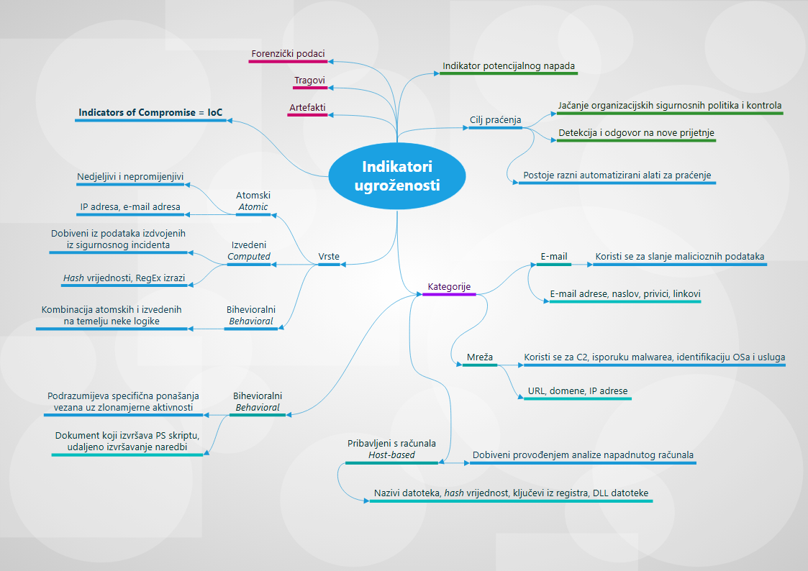

Indikatori ugroženosti odnose se na podatke koji pokazuju da je naš informacijski sustav kompromitiran i bio je meta napada. Ovi indikatori sigurnosnim timovima pružaju ključno znanje nakon ugroze sigurnosti u sustavu. Indikatori ugroženosti (engl. *indicators of compromise*) razlikuju se od indikatora napada (engl. *indicators of attack*) u tome što su indikatori napada usmjereni na identifikaciju aktivnosti povezanih s napadom koji je **u tijeku**, dok su indikatori ugroženosti vezani uz istraživanje stanja sustava **nakon** napada.

U nastavku dajemo razradu indikatora ugroženosti u obliku umne mape.

