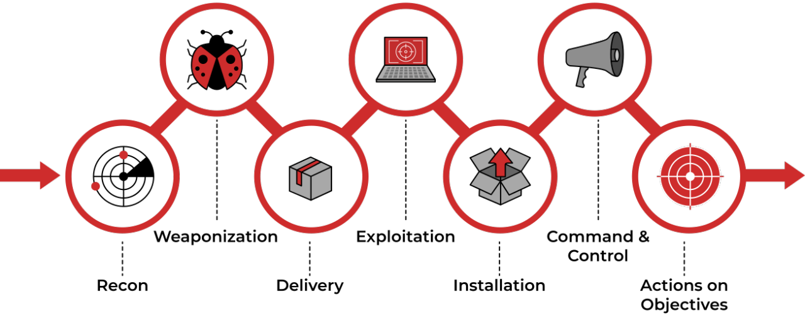

Jedan od najpoznatijih modela napada na informacijsku sigurnost, razvijen od strane korporacije Lockheed Martin, naziva se Cyber Kill Chain. Pomaže pri identifikaciji i prevenciji kibernetičkih napada, a identificira koje korake moraju provesti napadači kako bi postigli svoje ciljeve.

Onima koji su na drugoj strani omogućuje razumijevanje mogućih prijetnji na njihove informacijske sustave, prepoznavanje prijetnje u svakoj od faza napada te postavljanje adekvatnih protumjera za obranu. Sedam koraka ovog modela otvaraju mogućost ka većoj vidljivosti napada u organizaciji koja se štiti i sigurnosnim analitičarima omogućuje lakše razumijevanje napadačevih taktika, tehnika i procedura.

Koraci su sljedeći:

1. Reconnaissance (izviđanje) - napadači otkrivaju karakteristike mete prikupljanjem i analizom (javno) dostupnih informacija s ciljem pronalaska slabih točaka i ranjivosti, povezanosti s trećim stranama, te otkrivanja postojećih i novih ulaznih točaka.
2. Weaponization (naoružavanje) - na temelju informacija i ranjivosti definiranih u prošloj fazi, napadači se "naoružavaju" potrebim alatima za napad, što može uključivati pribavljanje hardverskih i softverskih alata, izradu malicioznog softvera i sl.
3. Delivery (isporuka) - napadači dolaze u kontakt s mrežom i korisnicima mete, npr. šalju phishing e-mail poruke s malicioznim softverom ili inicijalno infiltriraju mrežu koristeći identificirane ranjivosti i alate pribavljene u prethodnoj fazi.
4. Exploitation (iskorištavanje) - u ovoj fazi "oružje" se aktivira nad identificiranim ranjivostima i provodi se daljnja infiltracija mreže te potencijalno lateralno kretanje unutar ciljane mreže.
5. Installation (instalacija) - u prethodnoj fazi napadači su iskoristili ranjivosti i imaju pristup ciljanoj mreži, a u ovoj fazi instaliraju dodatne alate unutar sustava koji im omogućuju održavanje pristupa i stalnu prisutnost u mreži, kako bi kasnije mogli neometano postići svoje ciljeve.
6. Command and Control (C2, upravljanje i kontrola) - napadač uspostavlja dvosmjernu komunikaciju ili tzv. C2 kanal s ciljem upravljanja i kontrole, te prijenosa podataka. Ovakva komunikacija se na različite načine pokušava sakriti koristeći različite komunikacijske kanale poput Web prometa, e-mail poruka, DNS poruka uz nerijetko korištenje enkripcije.
7. Actions on Objectives (poduzimanje akcija nad ciljevima) - napadači poduzimaju akcije u skladu s njihovim ciljevima npr. provođenje DDoS napada, distribucija malicioznog softvera, krađa podataka, ucjena i sl.

