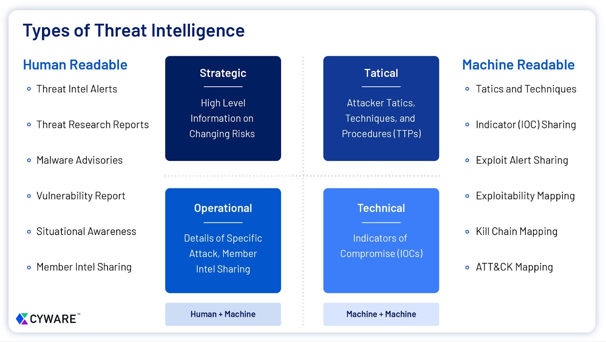

Cyber Threat Intelligence (CTI) predstavlja proces prikupljanja, analize i tumačenja podataka o prijetnjama vezanim za informacijsku sigurnost. Cilj CTIa je omogućiti organizacijama razumijevanje prijetnji, identifikaciju ranjivosti, sprječavanje potencijalnih napada i smanjenje rizika. CTI pruža informirane i pravovremene uvide koji omogućuju donošenje strateških, operativnih i taktičkih odluka.

### **Vrste CTI-a**

1. **Strateški CTI (engl. Strategic CTI)**
    - **Konzumenti:** Visoko rukovodstvo (C-level, izvršni direktori, odbori)
    - **Cilj:** Omogućiti donošenje strateških odluka o dugoročnoj informacijskoj sigurnosti organizacije
    - **Karakteristike:**
        - Fokus na dugoročne trendove i rizike
        - Koristi podatke o geopolitičkim rizicima, industrijskim prijetnjama i zakonodavnim promjenama
        - Često prikazan kroz izvještaje i analize bez tehničkih detalja
2. **Operativni CTI (engl. Operational CTI)**
    - **Konzumenti:** Sigurnosni menadžeri i analitičari u ITu
    - **Cilj:** Pomoći u identifikaciji i odgovoru na specifične prijetnje koje trenutno utječu na organizaciju
    - **Karakteristike:**
        - Fokus na trenutne prijetnje, poput zlonamjernih kampanja ili poznatih napada
        - Koristi tehničke podatke (IP adrese, hash-ove, domene) i analizira ponašanje napadača
        - Pruža preporuke za brzo djelovanje i sprječavanje prijetnji
3. **Taktički CTI (engl. Tactical CTI)**
    - **Konzumenti:** Inženjeri za informacijsku sigurnost i operativni timovi
    - **Cilj:** Optimizirati tehničke kontrole i sigurnosne alate za otkrivanje prijetnji
    - **Karakteristike:**
        - Fokus na tehničke detalje poput metoda napada, tehnika hakiranja i ranjivosti, tj. TTP napadača
        - Koristi se za ažuriranje pravila u sigurnosnim alatima (npr. firewall, IDS/IPS)
        - Podaci često dolaze u formi tehničkih dokumenata ili *feedova* za sustave
4. **Tehnički CTI (engl. Technical CTI)**
    - **Konzumenti:** Tehnički analitičari, razvojni timovi i timovi za incidente
    - **Cilj:** Pružiti vrlo specifične tehničke informacije o prijetnjama
    - **Karakteristike:**
        - Sadrži podatke poput IP adresa, malware hash-ova, indikatora ugroženosti (IoC)
        - Koristi se za otkrivanje i analizu specifičnih incidenata
        - Fokusira se na brzinu i preciznost informacija

### **Sažetak u tablici**

| **Tip** | **Konzumenti** | **Cilj** | **Karakteristike** |
| --- | --- | --- | --- |
| **Strateški** | Rukovodstvo (C-level) | Donošenje dugoročnih sigurnosnih odluka | Fokus na trendove, geopolitičke prijetnje, zakonodavne promjene |
| **Operativni** | Sigurnosni menadžeri, analitičari | Odgovor na trenutne prijetnje | Podaci o trenutnim napadima, preporuke za brzo djelovanje |
| **Taktički** | Inženjeri za sigurnost | Optimizacija sigurnosnih alata i procedura | Detalji o metodama napada i tehnikama, ažuriranje pravila u alatima |
| **Tehnički** | Tehnički analitičari | Pružanje specifičnih tehničkih informacija | IoC, tehnički podaci za analizu incidenata, brzina i preciznost |