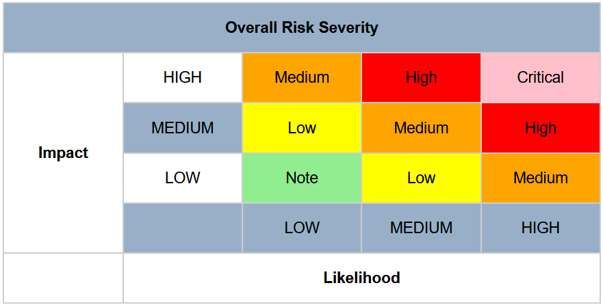

Prije no što se pozabavimo samim rizikom, važno je definirati osnovne pojmove kojima ćemo se susretati poput ranjivosti i prijetnje. Ranjivost (engl. *vulnerability*) je greška, nedostatak ili izloženost aplikacije, sustava, uređaja ili usluge koja, ukoliko bude iskorištena od strane napadača, uzrokuje ugrozu povjerljivosti, integriteta ili dostupnosti podataka (CIA trokut). Prijetnja (engl. *threat*) predstavlja vjerojatnost ili mogućnost izvora prijetnje (napadača) da slučajno ili namjerno iskoristi postojeće ranjivosti. Izvor prijetnje ne mora nužno biti napadač koji namjerno napada naš sustav, već to mogu biti i prirodne prijetnje poput elementarnih nepogoda, prijetnje okoline poput ispada električne energije ili vlastiti zaposlenici u poduzeću koji bez namjere naruše CIA trokut. Ukoliko napadač iskorištava specifičnu ranjivost, najčešće u toj situaciji koristi engl. *exploit* koji predstavlja specijalizirani program, niz podataka ili naredbi koji ima za cilj iskoristiti specifičnu ranjivost.

Sigurnosti rizik predstavlja stupanj nesigurnosti ili očekivanja potencijalne štete koju može imati neželjeni događaj kao rezultat realizacije određene prijetenje na temelju postojeće ranjivosti. Na temelju rečenog, možemo napisati formulu rizika koja glasi:

```
Rizik = Prijetnja x Ranjivost x Utjecaj
Rizik nad imovinom = Prijetnja x Ranjivost x Vrijednost resursa
```

Dana formula drugim rječima znači: što je viša razina prijetnje i količina ranjivosti koje te prijetnje mogu iskoristiti, te utjecaja (štete) kao rezultata iskorištavanja ranjivosti, to je rizik veći. Utjecaj možemo zamijeniti s vrijednošću ugroženog resursa čime dobivamo srodnu formulu. Utjecaj napada u stvarnom svijetu najčešće i izražavamo kroz novčni iznos.

U sustavu koji štitimo osnova borbe s rizikom je proces upravljanja rizikom ili plan upravljanja rizikom. Zadatak tog procesa jest smanjenje i održavanje rizika na prihvatljivoj razini kroz sustav dobro definiranog i aktivno primjenjivanog sigurnosnog programa. Ključna riječ je dakle održavanje rizika na prihvatljivoj razini, jer u prirodi, rizik je vjerojtnost i što god mi napravili, ne možemo svesti tu vjerojatnost na nulu, ali će nam biti cilj svesti je na prihvatiljivi minimum uz održavanje potrebne funkcionalnosti sustava i ulaganje razumnih sredstava. U procesu upravljanja rizikom možemo izdvojiti sljedeće faze:

1. Identifikacija (engl. *identification*) - identificiramo izvore, uzroke i posljedice internih i eksternih rizika.
2. Procjena (engl *assessment*) - procjenjujemo razinu rizika kao rezultat vjerojatnosti pojave štetnog događaja i posljedica koje mogu nastati te klasificiramo razinu rizika od vrlo niske do vrlo visoke.
3. Tretiranje (engl. *treatment*) - odabiremo i primjenjujemo odgovarajuće sigurnosne kontrole s ciljem smanjenja rizika.
4. Praćenje (engl. *tracking*) - osiguravamo da se odabrane kontrole primjenjuju.
5. Revizija (engl. *review*) - ocjenjujemo uspješnost primjenjene strategije upravljanja rizikom.

U procesu možemo primijeniti sljedeće strategije nošenja s rizikom:

- Izbjegavanje (engl. *avoidance*) - ignoriramo postojanje rizika, što nije najbolji izbor, no ponekad nemamo drugog izbora.
- Smanjenje (engl. *reduction*) - uz primjenu određenih kontrola, smanjujemo razinu rizika.
- Dijeljenje (engl. *sharing*) - dijelimo postojeći rizik s nekim ili nečim drugim, čime preuzimamo samo dio od ukupnog rizika na sebe.
- Prijenos (engl. *transferring*) - prenosimo sav ili dio rizika na nekoga ili nešto drugo, najčešće uz neku novčanu naknadu.
- Prihvaćanje (engl. *acceptance*) - uz odair strategija smanjenja, dijeljenja ili prijenosa rizika, često nam ostaje određena razina rizika koju ne možemo u potpunosti ukloniti, a zove se rezidualni rizik koji onda moramo prihvatiti.

Rizik možemo kvantificirati brojevima ili kvalitativno procjeniti, a sam proces koji god put odabrali je dosta složen i dugotrajan, zahtjeva mnogo radnih sati stručnjaka.

U kvantitativnoj procjeni možemo koristiti sljedeći niz formula i izračuna:

```
SLE (Single Loss Expectancy) = AV (Asset Value) x EF (Exposure Factor) [0-1]
ARO (Annual Rate of Occurence) [0+]
ALE (Annual Loss Expectancy) = SLE x ARO

Asset Value = vrijednost resursa u valuti
Exposure Factor = faktor izloženosti, postotak vrijednosti resursa koji se gubi zbog štetnog događaja
Single Loss Expectancy = gubitak koji možemo očekivati prilikom jednog štetnog događaja nad resursom
Annual Rate of Occurence = broj štetnih događaja koji se očekuju na godišnjoj razini za navedeni resurs
Annual Loss Expectancy = gubitak u valuti koji očekujemo na određenim resursom zbog određenog rizika na godišnjoj razini
```

### Primjer

- Pretpostavimo da je vrijednost resursa 75000 EUR.
- Pretpostavimo da je faktor izloženosti EF = 0.75 (75%).
- Izračunajmo SLE = 75000 x 0.75 = 56250 EUR.
- Odredimo ARO. Pretpostavimo da iznosi 0.95 što znači da postoji 95% šanse napada u jednoj godini.
- Izračunajmo ALE = 56250 EUR x 0.95 = 53357.50 EUR.
- Usporedimo ALE s cijenom licence za softvera za zaštitu resursa, ukoliko je ona manja, ulaganje se isplati, u protivnom se ne isplati.

Za određivanje praga rizika možemo koristiti matricu rizika. Na temelju matrice možemo kao rezultat procjene odrediti koji rizici su nam prihvatiljivi, a koje moramo smanjiti ili ukloniti na neki način. Matrica rizika prikazuje razinu rizika ovisno o vjerojatnosti štetnog događaja i utjecaja koji štetni događaj može imati. Gledajući matricu rizika koju smo izradili za određenu konkretnu situaciju dobivamo bazu za prioritizaciju koje rizike moramo nužno riješiti i kojim redoslijedom.

