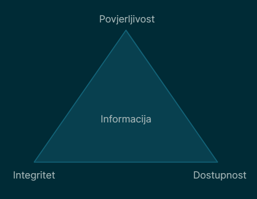

Sigurnost informacijskog sustava može se promatrati kroz model koji se sastoji od tri temeljne komponente.

- Povjerljivost, engl. confidentiality
- Integritet, engl. integrity
- Dostupnost, engl. availability

Sustav ovih triju komponenata grafički možemo promatrati kao trokut unutar kojega se nalazi informacija ili objekt koju želimo zaštititi i tako dobivamo tzv. CIA trokut (engl. CIA triad).

Povjerljivost podrazumijeva tajnost informacija, odnosno želimo da informacija bude dostupna samo onima koji za to imaju dozvolu ili ovlaštenje, tj. autoriziranim korisnicima. Za sve ostale informacija ne bi trebala biti dostupna. Razotkrivanje povjerljivih informacija događa se najčešće uslijed nepažljivog korištenja informacija od strane osoba koje imaju ovlaštenje ili nezakonitim razotkrivanjem od strane kriminalaca.

Integritet znači da informacija smije biti izmijenjena planski i od ovlaštenih osoba. Bilo kakva nepoželjna manipulacija informacijom tijekom prijenosa, obrade ili pohrane smatra se napadom na integritet informacije. Integritet informacije može se narušiti namjerno ili slučajno, bilo od strane ovlaštenih ili neovlaštenih korisnika. Također, na integritet informacije mogu utjecati i vanjski čimbenici poput nestanka struje.

Dostupnost znači da informacija mora biti dostupna onda kada je potrebna. Obično se informacije i informacijski sustavi koriste u donošenju odluka, a odluka obično ima i vremensku komponentu. Napadi na dostupnost poznati su kao napadi uskraćivanja pristupa (engl. denial of service). Ukoliko ne možemo pristupiti usluzi onda kada nam to treba ili donijeti odluku na vrijeme, u poslovnom svijetu ovo može uzrokovati gubitak profita ili utjecati na ugled.

Uz spomenute komponente spominju se još dvije dodatne komponente.

- Autentičnost engl. authenticity
- Neporecivost engl. non-repudiation

Autentičnost podrazumijeva da je osoba ili informacija stvarno ona koja jest - originalna i vjerodostojna, a da ne predstavlja nešto drugo ili je na bilo koji način kompromitirana.

Neporecivost je komponenta koja osigurava da se informacija ne može poreći, npr. ako osoba pošalje poruku određenog sadržaja, ne može kasnije poreći da je upravo ona ta osoba koja je poruku poslala.