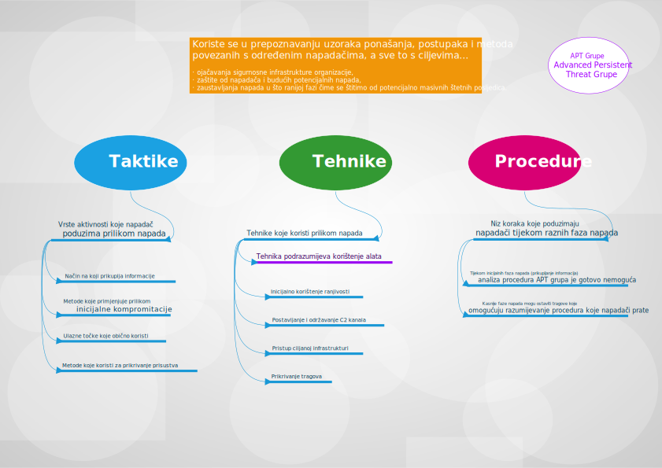

Analiza taktika, tehnika i procedura napadača omogućuje razumijevanje načina na koji napadači djeluju čime može pomoći sigurnosnim inženjerima da otkriju i ublaže napade.

Općenito, taktike su vrste aktivnosti koje napadači koriste za izvođenje napada. Na primjer, dobivanje neovlaštenog pristupa osjetljivim podacima, izvođenje bočnog kretanja unutar mreže ili ugrožavanje Web stranice. Taktike daju odgovor na pitanje "zašto?" u vezi samog napada.

Tehnike su opće metode koje napadači koriste za postizanje svojih ciljeva. One daju odgovor na pitanje "kako?" u vezi samog napada. Na primjer, ako je cilj kompromitirati Web stranicu, tehnika može biti SQL injection napad. Svaka taktika može se sastojati od nekoliko tehnika.

Procedura je određeni niz koraka koje napadači mogu koristiti za izvođenje napada. Na primjer, SQL injection napad može uključivati skeniranje ciljane Web stranice u potrazi za ranjivostima, pisanje SQL upita koji uključuje zlonamjerni kod i njegovo slanje u nezaštićeni obrazac na Web stranici kako bi se dobila kontrola nad poslužiteljem.

U nastavku dajemo i umnu mapu u vezi navedene tematike.

Jedna od napoznatijih platformi i baza znanja napadačevih taktika i tehnika baziranih na analizi stvarnih napada je MITRE ATT&CK platforma dostupna na Web stranici: [https://attack.mitre.org](https://attack.mitre.org/).