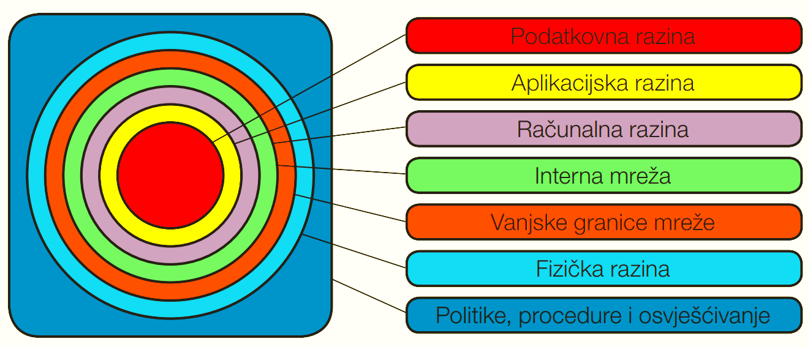

Višeslojni strateški model sigurnosti predstavlja slojeviti pristup u dizajniranju sustava sigurnosti. Sustav ćemo dizajnirati tako da definiramo slojeve pristupa sustavu s jasnim granicama među pojedinim slojevima i postavljanjem određenih sigurnosnih kontrola među slojevima. Smisao ovakog dizajna jest usporiti napadača u pristupu željenom resursu u organizaciji na način da prisilimo napadača na probijanje više slojeva s različitim kontrolama, ponekad i redundantnim (ponavljajućim) kontrolama. Probijanjem jednog sloja s pratećim sigurnosnim kontrolama vodi napadača na novi sloj s novim kontrolama i izazovima. Na taj način, ne samo da napadača usporavamo ili čak sprječavamo da pristupi traženom rasursu, već ga prisiljavamo na neki način da na različitim slojevima ostavi tragove koje možemo detektirati i otkriti napad na vrijeme prije nego napadač pristupi osjetljivom resursu. Višeslojni strateški model sigurnosti ili tzv. zaštita u dubinu (engl. *defense in depth*) je vojni princip koji se može primijeniti i na druga područja, a jedno od njih je upravo informacijska sigurnost.

1. Prva vrsta sigurnosnih kontrola su fizičke kontrole. Cilj fizičkih kontrola jest uskratiti osobama bez odgovarajućih dozvola fizički pristup infrastrukturi. Fizički pristup je ultimativni pristup, osobito na području informacijske sigurnosti.
2. Druga vrsta kontrola jesu tehničke kontrole. Tehničke kontrole uključuju primjenu vatrozida (engl, *firewall*), sustava za detekciju ili sprječavanje upada (IDS, engl. *intrusion detection system* ili IPS, engl. *intrusion prevention system*), sustava za upravljanje sigurnosnih informacija i događaja (SIEM, engl. *security information and event management*), antivirusnih programa i druge sigurnosne tehnologije. Ovdje također spadaju i softverske i konfiguracijske kontrole poput složenosti zaporki. Bilo koji hardver ili softver koji za cilj ima spriječiti nedozvoljeni pristup spada u tehničku kontrolu.
3. Treća vrsta kontrola su administrativne kontrole. Tu spadaju politike, standardni i procedure, nezaobilazne su u svakoj organizaciji i njihov cilj je definirati kako će se organizacija štititi.